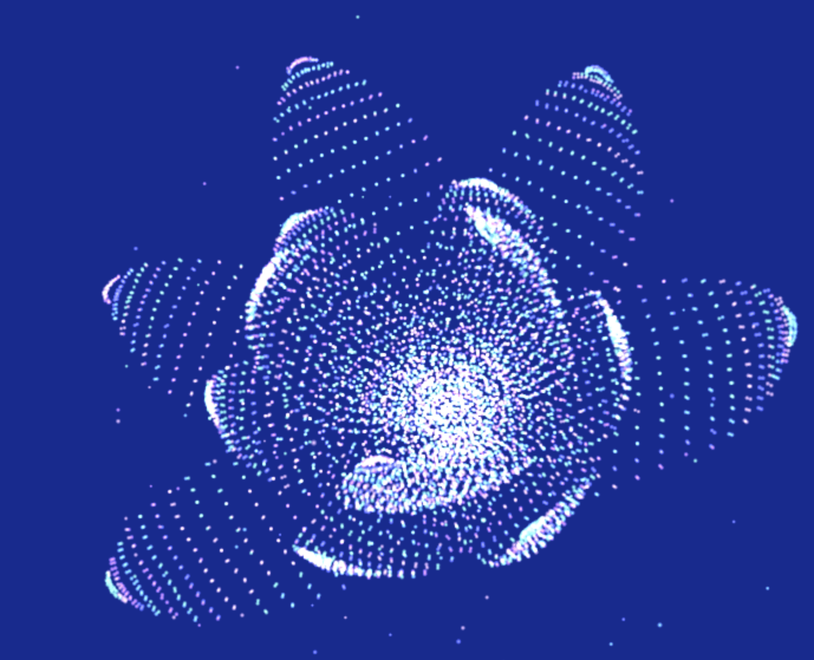

# Kathryn Miller

## Particle collection

I created a Particles class which handled all of the operations on my particles such as attraction, mesh formation, and also handled setting the offset and color data for each square representing a particle. In order to get my particles to move, I used Verlet integration and created a method that would apply a force to each particle and return the correct acceleration. In order to use Verlet, I needed to store all current and previous positions of each particle as well as the previous time value. The particles only had an acceleration when a force was being acted on them. Otherwise their velocity was determined by their current and previous position.

## Procedural coloration and shaping of particles

Using Adobe's color palette tool I chose five colors of the same brightness but different hue to create a pastel palette. Each particle is colored based on it's distance from the center of the screen unless there is an attractive or repeling force due to the user. In this case, the particles are colored based on their distance from the intended target. 

## Interactive forces

In order to keep all of my particles from drifting off screen, I force them to stay within a sphere by testing their future positions distance from the center and applying a force in the opposite direction of their movement (with a small offset for non linear motion) if the position was outside the radius of the circle. 

### Attracting Particles

In order to have my particles flock to a particular target, I split the particle motion into two initial cases. I found the current direction of movement by subtracting the current future position from its prospective future one. If this dotted with the vector from the particle to the target was positive, the particle was already heading towards the target so I didn't apply any force. If the dot product was negative, I applied a force in the direction of the target in order to turn the particle around. However, I didn't want all of the points to end up exactly on the target so I employed a sort of spring system based on the input strength of attraction. If a particle was heading away from the target but was within some randomly assigned radius, (with the maximum radius being dependent on the input attraction strenght) I did nothing. Otherwise I reversed the particle direction. So, by toggling with the attraction strength in the gui, the user can change the radius that the particles will eventually converge to. 

### Repelling Particles

Repelling the particles from a target was much simpler as I just said if a particle was within a certain radius, accelerate it away from the target.

## Mesh surface attraction

For surface attraction I began by writing a pseudo obj loader as the one used in previous projects had the vertices triangulated already and I only wanted one particle per vertex. So my obj loader class takes the vertex data and just adds it to one big array of arrays to be used later. Then, in order to make my mesh fuller I parsed the face data such that I would know which vertices formed triangles. I then added a vertex point in the middle of each triangle and appended it to a list of extra vertices. This list of extra attractor points was then added to my final list of vertex positions to be used in the particle class. Since I already had a function in the particle class that would attract a particle to a given target, all I did from there was check if the particles should be attracting to a mesh, and if so, input a corresponding mesh vertex position as a target for the current particle with a small radius so that the particle would eventually converge to jitter around the mesh attractor point.
